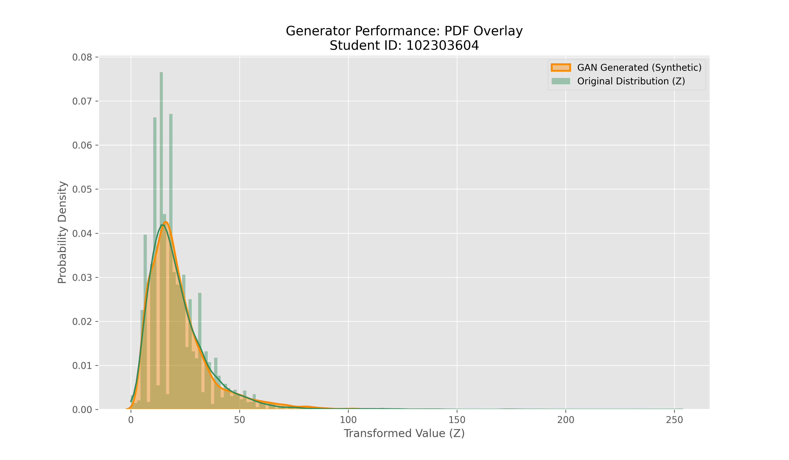

# Learning Probability Density Functions using GANs

## Objective
To learn an unknown probability density function of a transformed random variable using only data samples and a Generative Adversarial Network (GAN).

## Dataset
- India Air Quality Dataset (Kaggle)
- Feature used: NO₂ concentration

## Methodology
1. Extract NO₂ values from the dataset
2. Apply nonlinear transformation: z = x + a_r sin(b_r x)
3. Train a GAN using samples of z
4. Generate samples from the trained generator
5. Estimate PDF using Histogram and KDE

## Tools Used
- Python
- NumPy
- Pandas
- PyTorch / TensorFlow

## Results

